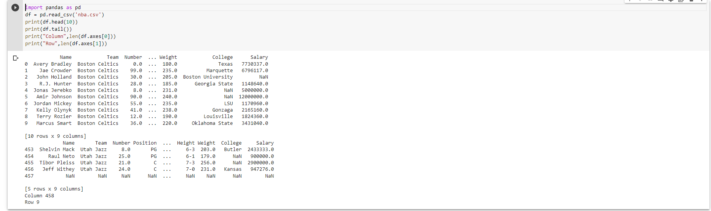

# Read-from-CSV

## AIM:
To read a csv file and access the data

## ALGORITHM:
### Step 1:
Start python

### Step 2:
Import the required csv file.

### Step 3:
Import pandas

### Step 4:
Read the csv file by using df.read.

### Step 5:
Display the Columns.

### Step 6:
Display the Rows.

### Step 7:
End the program
## PROGRAM:
```

import pandas as pd
df = pd.read_csv('nba.csv')
print(df.head(10))
print(df.tail())
print("Column",len(df.axes[0]))
print("Row",len(df.axes[1]))
```

## OUTPUT:


## RESULT:
Therefore the program is successfully executed to read csv file and access the data in it.
